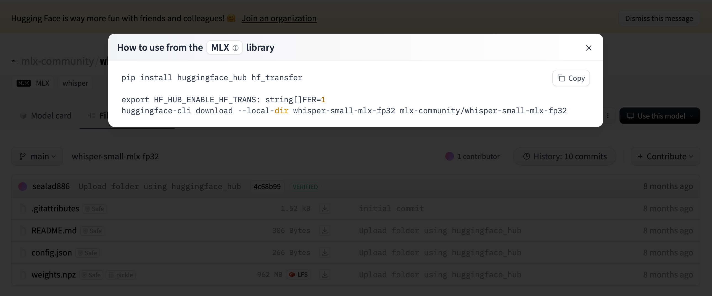

this repo is inspired by [mlx-examples](https://github.com/ml-explore/mlx-examples/tree/main/whisper) developed by Apple Inc. with the asisstance of ChatGPT and Cursor.AI.

Through trial and errors, I have found that ChatGPT Canvas as well as 4o-mini is really amazing at analysing the github repo as well as brainstroming. 

### brainstorming: 

At the very beginning, I have asked the ChatGPT this:

> base on the repo:https://github.com/ml-explore/mlx-examples/tree/main/whisper,If I were to   transcribe a long audio( 1-2 hours long) using MLX framework at Mac computer( M1 pro chip), what is the most tricky part of the task, Make a complete and structured analysis.

so it responds with audio chunking, memory management, model selection(tiny, small, medium or large), env setup, etc. the above all is important.

you can see the chat history [here](https://chatgpt.com/share/6717c2ea-ea04-8002-a890-d2ad6f877606)

### start form the scratch in ChatGPT.

so we could start by writing short test codes( as indicated in this repo) in ChatGPT Canvas, especially the `mlx_whisper()`function, how to set parameters is really important. Cursor AI performed poorly in analysing the github repo function, which cost me hours to figure out.

but Cursor AI with Claude is good at writing hundred lines of code. so in practice, we can start from scratch in Canvas, when we have tested every funtion works right in short tests, we can then transfer to Claude.

### Introduction to the repo:

this repo use mlx framework developed by Apple, to make the best use of Mac M series chip to perform the transcription.

Main Features: 

audio chunking, inspired by brainstroming in ChatGPT first.

memory management,  inspired by brainstroming in ChatGPT first.

prompting, when transcribing it will indicates the progress.

### how to use 

1.first you need to create an environment, I prefer using python env:

> python3 -m venv mlx_transcription_env
>
> source mlx_transcription_env/bin/activate

2. Install Required Libraries

- ffmpeg
- pydub
- joblib
- torch
- torchvision
- torchaudio
- mlx-whisper

3. download offline whisper models:

   to download, please visit [mlx-community](https://huggingface.co/mlx-community), choose a converted model, for eg. whisper-small-mlx-fp32, from the right upper box, click `use this model`, then 

   > pip install huggingface_hub hf_transfer
   >
   > huggingface-cli download --local-dir whisper-small-mlx-fp32 mlx-community/whisper-small-mlx-fp32

   

   after having successfully downloaded the model, it is preferablly to rename the folder to `small-fp32` and move the folder to `mlx-models\small-fp32`.

   4. now you can use the `whipser_transcrib.py`, you should modify several lines of code to specify the audio file path, prompt, target language etc. see the comment inside.

   

   Hope you will enjoy it, welcome to any feedback from you guys.

   

   